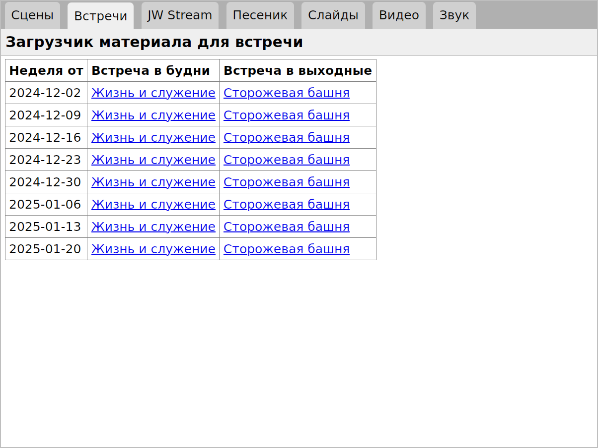

# Pub-Tools

Pub-Tools is a suite of Python-Flask apps for downloading and displaying
publications from JW.ORG. These include an Epub viewer and scripts for
OBS Studio which turn it into a media player for use at congregation meetings.

## Installing Pub-Tools

To install on Ubuntu and other Debian-family Linuxes:

    $ sudo apt-get install git cmake ffmpeg pulseaudio-utils python3-pip python3-venv
    $ git clone https://github.com/david672orford/pub-tools.git
    $ cd pub-tools
    $ ./venv_tool.py --create

To install on Microsoft Windows:

    > winget install --id Git.Git -e --source winget --scope user
    > winget install -e --id Python.Python.3.12 --scope user
    (Close and re-open the terminal)
    > cd Desktop
    > git clone https://github.com/david672orford/pub-tools.git
    > cd pub-tools
    > python venv_tool.py --create

## Running Pub-Tools in Your Web Browser

Start the Pub-Tools web server on Linux:

    $ ./start.py

On Microsoft Windows:

    > python start.py

Then open this URL in a web browser:

    http://localhost:5000

## Running Pub-Tools in the Standalone Viewer

The **pub-tools** script wraps Pub-Tools into a standalone application.
It first starts the Python-Flask backend and then opens it in a web browser
widget. When the viewing window is closed it shuts down the server.

To start it on Linux:

    $ ./pub-viewer

On Microsoft Windows:

    > python pub-viewer

## The Subapps

When you open Pub-Tools in a web browser as described above the first
thing you will see is a menu of the subapps. 

### KH Player

[KH Player Documentation](docs/subapp-khplayer.md)

### Teaching Toolbox Sharing Tool

[Teaching Toolbox Viewer Documentation](docs/subapp-toolbox.md)

### Epub Reader

[Epub Reader Documentation](docs/subapp-epubs.md)
