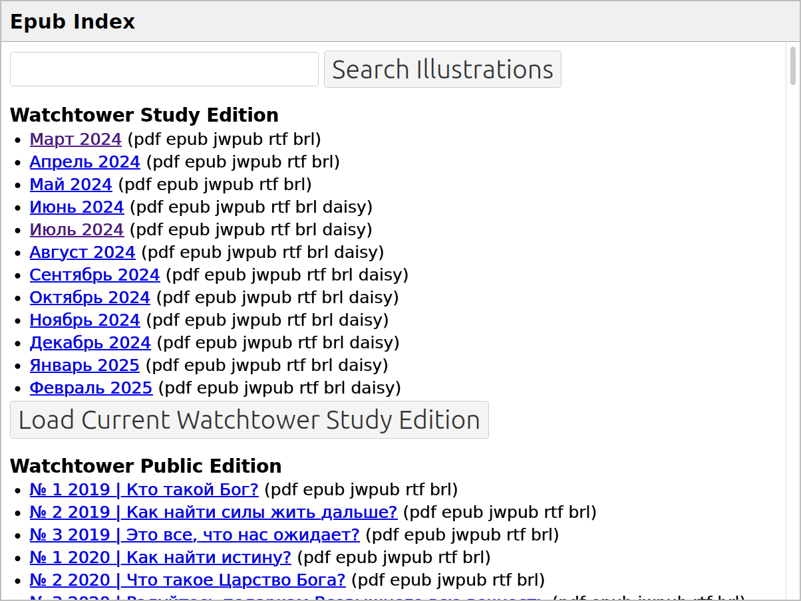

# The Epub Reader Subapp

This is an experimental framework for downloading and viewing Epub files
from JW.ORG in a web browser.

## Running the Epub Reader

Start the Pub-Tools web server:

    $ ./start.py

On Microsoft Windows:

    > python start.py

Then open this URL in a web browser to see the list of publications:

    http://localhost:5000/epubs/
