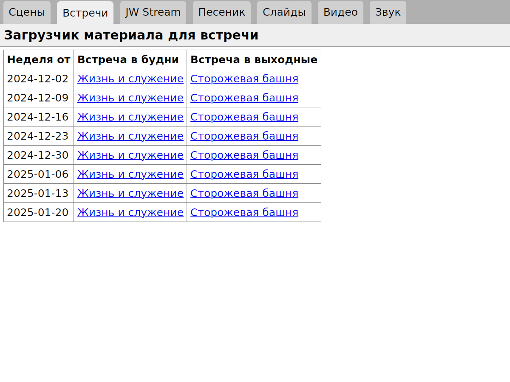
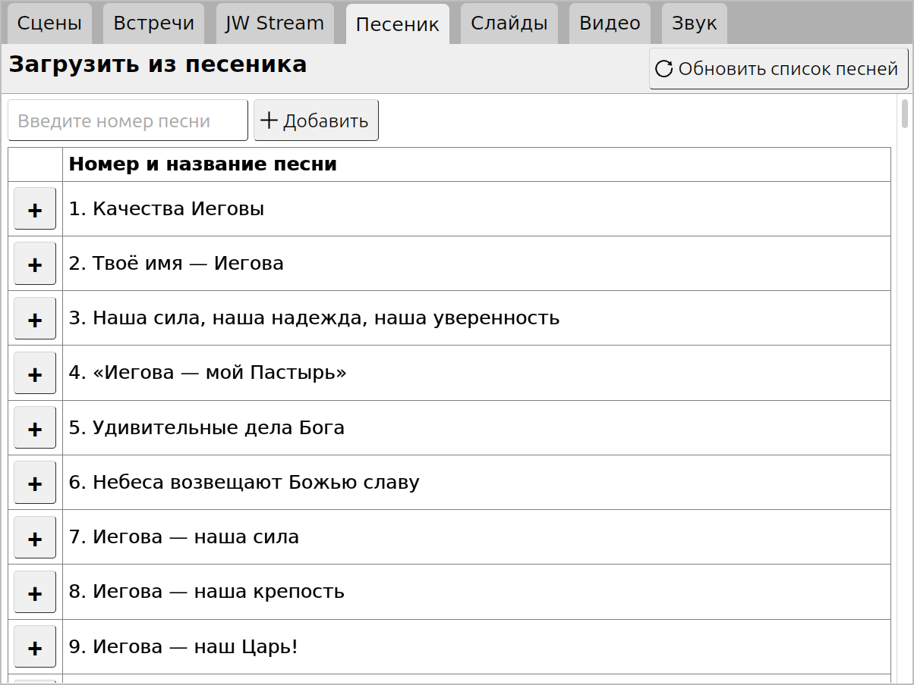

## The KH Player Subapp

NOTE: This document is in a state of flux as we attempt to simplify the setup of KH Player.
Until this work is complete it may contain conflicting, incomplete, or confusing instructions.

This is the most well-developed of the modules. It helps you to load the videos
and illustrations for a congregation meeting into OBS Studio ready to play.
This note describes how to set up OBS to play the videos at meetings while
some participants are connected by Zoom.

## Install OBS Studio

On Ubuntu Linux 22.04 or later:

    $ sudo add-apt-repository ppa:obsproject/obs-studio
    $ sudo apt install obs-studio

On Microsoft Windows:

    > winget install --id=OBSProject.OBSStudio -e

The KH Player module communicates with OBS over a websocket. You will need to use
OBS version 2.8 or later. Enable the websocket plugin in **Tools** →
**Websocket Server Settings**. If KH Player cannot find your OBS configuration
to get the websocket port and password, set OBS\_WEBSOCKET in config.py
using the example in sample-config.py.

## Test Run

Start the Pub-Tools web server:

    $ ./start.py

On Microsoft Windows:

    > python start.py

Then open this URL in a web browser:

    http://localhost:5000/khplayer/

A window will appear with tabs such as **Meetings**, **Songs**,
and **Videos**.

## Initial Setup of OBS

* In the settings under **Video** set the **Base (Canvas) Resolution** and
  **Output (Scaled) Resolution** to 1024x720.
* In the settings under **General** find **Projectors** and check the boxes next to
  **Make projectors always on top** and **Limit one fullscreen projector per screen**.
* In the settings under **Advanced** uncheck **Show active outputs warning on exit**.
* Under the **Tools** menu find the OBS-Websocket plugin and enable it
* Go to **Tools**, **Scripts** and add the following scripts from the **obs-scripts**
directory of this project:
  * **khplayer-server.py** -- Run the Pub-Tools web server inside of OBS so we will not need
  * **khplayer-automate.py** -- Simplify startup and playing of vidoes
    * At Startup:
      * Start a fullscreen projector video output on the monitor you select
      * Start the virtual camera
      * Switch to the yeartext scene you have selected
    * Mute the microphone whenever the yeartext scene is displayed
    * When a Video is played:
      * Mute the microphone. This improves quality of the sound heard by participants on Zoom considerably.
      * Stop the playing of videos from JW.ORG a few seconds before the end so the speaker will not have to wait for the end card to disappear.
      * Return to the state scene you specify whenever a video finishes playing.
  * **khplayer-zoom-tracker.py**
  * **khplayer-zoom-participant.lua**

## Initial Setup of Zoom

* Under **Video** select **Original ratio** and **HD**. Turn off **Mirror my video**.
* Still under **Video** choose **See myself as the active speaker while speaking**.
* Under **Audio** set **Suppress background noise** to **Low** so that music will not be muted.

## Set Up a Video Loopback Device on Linux

    $ echo v4l2loopback \
    $     | sudo tee /etc/modules-load.d/v4l2loopback.conf
    $ echo 'options v4l2loopback video\_nr=10 card_label="OBS Virtual Camera"' \
    $     | sudo tee /etc/modprobe.d/v4l2loopback.conf
    $ sudo modprobe v4l2loopback

## Audio Setup

We need a way to have the sound from videos played over the loudspeakers in the hall and sent into Zoom,
but we must not feed the sound from the microphones into the speakers. There are three known ways
to accomplish this.

### Option 1: Virtual Audio Cables in Pipewire

Install the new audio subsystem called Pipewire on Ubuntu 22.04 following the instructions
in the document [Pipewire on Debian](https://pipewire-debian.github.io/pipewire-debian/).
Be sure to follow the part about installing Wireplumber.

If you are running Ubuntu 24.04 or later, then Pipewire is already in the main package
repository. Skip the part about added in the 3rd-party repository and proceed from there.

Once you have Pipewire installed and working, add **khplayer-cable.py** to OBS. This script
will create two virtual audio cables when OBS starts and tear them down when it exits.
The cable will be used to connect OBS, Zoom, the Microphone, and the loadspeakers in the
proper configuration.

You can select the microphone and loudspeakers either in the options of the **khplayer-cable.py**
script or in the **Audio** tab of KH Player. Press **Reconnect Audio** to connect then to Zoom and OBS.

If you are using this method:

* Select **From-OBS** as the audio input in Zoom
* In the settings of OBS under **Audio** set the **Monitoring Device** to **Monitor of To-Zoom**
* Under **Docks** uncheck **Audio Mixer** since we will not be using it

### Option 2: Audio Output Plugin for OBS

OBS does not provide a way to output mixed audio. However, we have create a plugin which will
add this function on Linux. To implement:

* Install the plugin
* Delete the pulse_linux.so plugin
* Add the script audio-vcam.lua to OBS
* Start OBS and select **Virtual Camera Audio** as the microphone
* Select the desired speakers as the audio monitoring device in OBS

### Option 3: Share System Sound in Zoom

This method requires no additional software or special configuration. To implement:

* Select the microphone as the input device in Zoom
* Select the desired speakers in Zoom
* Select the same speakers as the monitoring device in OBS
* When you start the meeting, go into **Screen Sharing** and select **Share System Audio**.

## Starting the Meeting

* Start OBS.
* Start Zoom. Make sure a second window appears on the second monitor.
* Log in to Zoom and start the meeting.
* Click on the down arrow next to the camera button and select **OBS Virtual Camera**
  as the camera. Turn it on. If it will not turn on, make sure the virtual camera is started in OBS.
* Click on the down arrow next to the microphone button and select the appropriate input
  for the sound configuration method you selected above. Unmute the microphone.

## Initial Setup of Yeartext and Stage Scenes

* Open **http://localhost:5000/khplayer/** in a web browser or create an OBS browser dock for it.
* Go to the **Scenes** tab.
* Press the **+Add Scene** button, then **+Empty Scene**.
* Switch to the empty scene, hit the **Layout** botton, and rename the secene to "* Yeartext". Putting an asterisk at the start of the name will protect it from automatic deletion when you load meeting material.
* Go to the **Sources** panel in OBS and add text sources for the yeartext. You will probably need to create one source for each line.
* Press the **+Add Scene** button, select the desired camera and press the **+Camera** button.

## Loading Videos and Images for a Meeting

* Go to the **Meetings** tab and press **More Weeks** to load a list of upcoming meetings from JW.ORG.
* Select the meeting and week you want. A list of videos and illustrations will load.
There will be a checkbox next to each item. Remove the checkbox for any item you do
not need and press the **Download Media and Create Scenes in OBS** button.
* If you are loading material for the weekend meeting, go to the **Songs** tab and
load the song chosen by the speaker.

## Loading Additional Songs

## Loading Clips from JW Stream

* Go to the **JW Stream** tab. Click on **Configuration**. Paste one
or more sharing URLs from JW Stream into the box and press **Save**.
* A table will appear with one row for each URL you entered. Click on the
one you want.
* A list of recorded events will appear. Click on the one you want.
* A player will appear. Find the start of the clip you want. You can use
the skip buttons and the chapter buttons to help you. Hit the **Set Start**
button.
* Find the end of the clip. Press the **Sent End** button.
* Adjust the **Clip Title**, if necessary, and press **Make Clip**.

## Loading Speaker's Slides

KH Player can load images and videos which you have placed in a folder to which
you have pointed it. The folder can be local or on Google Drive.

Local setup:

* Place media files in the instace/slides folder
* Go into the **Slides** tab in KH Player and press the **Settings** button
* Make sure the URL is blank and press **Save**

Google Drive setup:

* Create a new folder within your Google Drive
* Share it to "anyone who has the link". Copy the link.
* Go into the **Slides** tab in KH Player and press the **Settings** button
* Paste the Google Drive link in and press **Save**

Loading slides:

* Put any of the following into the local or Google Drive folder selected above
    * Subfolders containing JPEG, PNG, or MP4 files
    * Zip files containing JPEG, PNG, or MP4 files
    * Playlists in .jwlplaylist format
    * Playlists in .JWPUB format. If the playlist includes videos, download them too and save them in the folder alongside the .JWPUB file.
* Go back to the **Slides** tab and browse to the folder you want.
* Adjust the check marks next to the slide images and press the **Load** button.

## TODO

We need to cover these additional topics.

* Drag and drop into scenes
* Renaming Cameras
* Subtitles
* Virtual Camera
* Equalizer
* Renaming Microphones
* Disabling Distracting Devices
