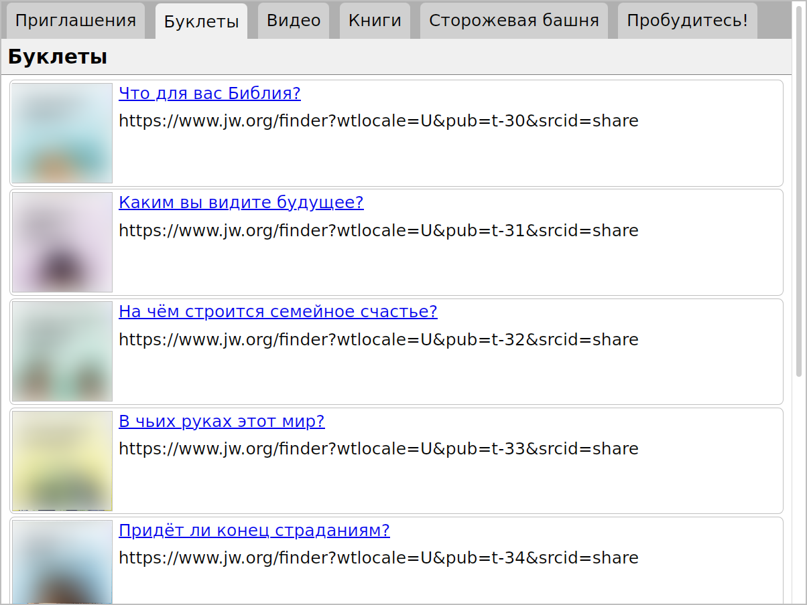

# The Teaching Toolbox Viewer Subapp

This subapp displays a list of the publications from the Teaching Toolbox
along with the link to it on JW.ORG. It is intended for use in telephone
witnessing as a quick way to find a publication and send a link.

## Setup

Before using this module, load the lists of publications:

    $ flask jworg update-periodicals wp all
    $ flask jworg update-periodicals g all
    $ flask jworg update-books
    $ flask jworg update-videos VODMinistry VODMinistryTools

## Running the Teaching Toolbox Viewer

Start the Pub-Tools web server:

    $ ./start.py

On Microsoft Windows:

    > python start.py

Then open this URL in a web browser:

    http://localhost:5000/toolbox/
